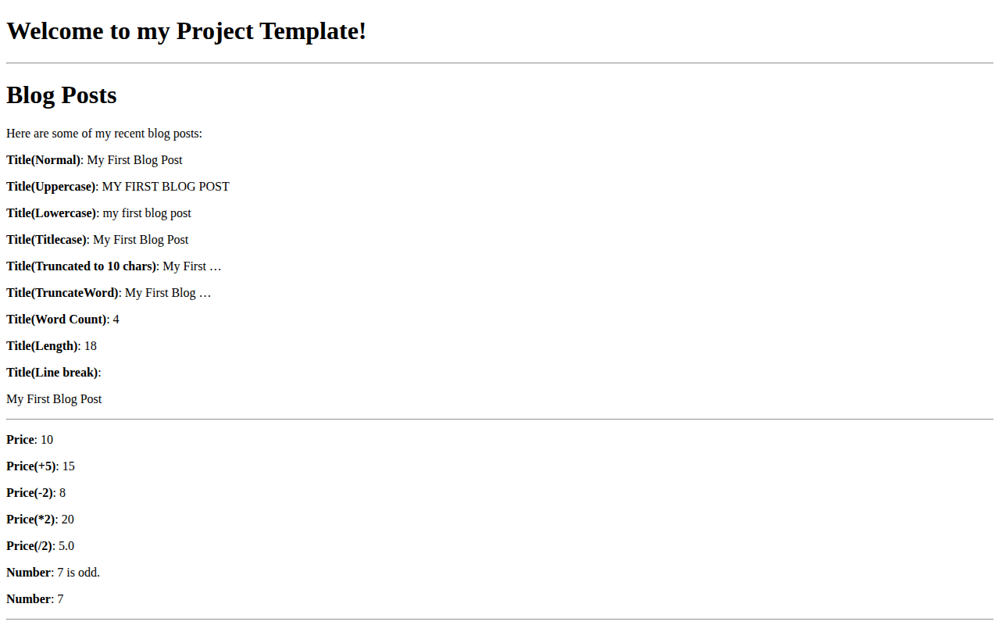
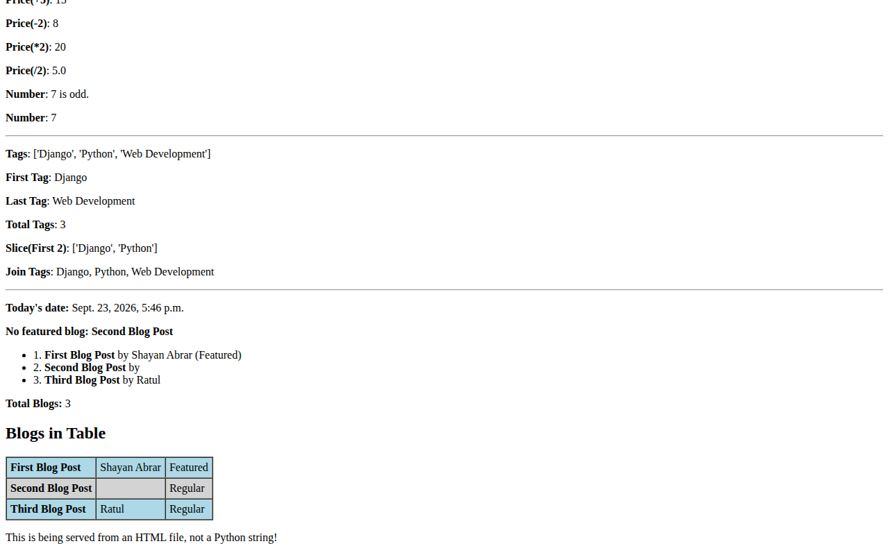
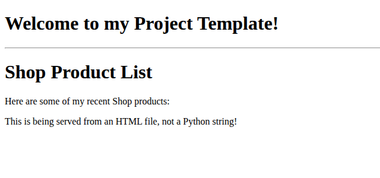

# Django First Practice

A small Django 6 project for practicing URL routing, function-based views and the Django Template Language across two apps.

<p align="center">
  <a href="screenshots/post-list-filters.png"></a>
</p>

<table>
  <tr>
    <td align="center"><a href="screenshots/post-list-loops.png"></a><br><sub><b>Loops, <code>with</code> and <code>cycle</code></b> · /blog/post_list/</sub></td>
    <td align="center"><a href="screenshots/shop-product-list.png"></a><br><sub><b>Template inheritance</b> · /shop/product_list/</sub></td>
  </tr>
</table>

Django's basics are easier to learn when each feature is tried on its own. This project keeps every experiment small: each route demonstrates one idea (path converters, a regex route, keyword arguments), and one template page runs sample data through the common filters and tags, so the input and output sit side by side.

## Quick Start

You need Python 3.12 or newer, which Django 6.0 requires.

```bash
git clone https://github.com/SHAYAN-ABRAR/Django-First-Practice.git
cd Django-First-Practice
python3 -m venv venv
source venv/bin/activate            # Windows: venv\Scripts\activate
pip install "django>=6.0,<6.1" django-mathfilters
python manage.py migrate
python manage.py runserver
```

Open <http://127.0.0.1:8000/blog/post_list/>. The repository has no `requirements.txt`, so the `pip install` line lists the two packages the code imports.

**On Linux**, also run `ln -s Templates templates` before `runserver`. The settings look for a lowercase `templates` folder, but the folder in the repository is `Templates`. Windows and macOS don't distinguish the two, but Linux does. Without the link, the template pages return `TemplateDoesNotExist`.

## Features

- **URL routing:** each app has its own `urls.py`, included from the project URLconf with `include()`.
- **Path converters and regex:** `<int:post_id>` and `<str:username>` converters, a four-digit year matched with `re_path()`, and a route that takes two parameters.
- **Function-based views:** some views return inline HTML through `HttpResponse`. Others use `render()` with a template.
- **Template inheritance:** pages extend a shared `Templates/base.html` with `` and ``.
- **Template filters:** `upper`, `lower`, `title`, `truncatechars`, `truncatewords`, `wordcount`, `length`, `linebreaks`, `add`, `divisibleby`, `first`, `last`, `slice` and `join`, plus `mul` and `div` from django-mathfilters.
- **Template tags:** `if`/`else`, `for` with `forloop.counter` and `empty`, `with`, `cycle` and `comment`.

## Routes

| URL | What it shows |
| --- | --- |
| `/blog/` | A view that returns an `HttpResponse` |
| `/blog/about/` | Inline HTML with a value computed in the view |
| `/blog/post/<int:post_id>/` | Integer path converter |
| `/blog/user/<str:username>/` | String path converter |
| `/blog/article/<year>/` | Four-digit year matched with `re_path()` |
| `/blog/article/<int:year>/<int:month>/` | Two URL parameters passed as keyword arguments |
| `/blog/post_list/` (also `/blog/blog_details/`) | The filters and tags page |
| `/shop/` and `/shop/products/` | A second app with its own routes |
| `/shop/product_list/` | Template inheritance in the second app |
| `/admin/` | Django admin login |

## Usage Example

The two-parameter route in `blog/urls.py` passes both values to the view as keyword arguments:

```python
path("article/<int:year>/<int:month>/", views.article_detail, name="article_detail"),
```

Visiting `/blog/article/2024/5/` returns:

```text
BLOG Article Detail Page from {'year': 2024, 'month': 5}!
```

## Limitations

- **Development settings only:** `settings.py` has `DEBUG = True`, an empty `ALLOWED_HOSTS` and a committed development `SECRET_KEY`. Don't deploy the project as it is.
- **No models:** both apps have empty `models.py` files, so the database only holds Django's built-in tables.

## Tech Stack

- Python 3.12+
- Django 6.0 (the project was created with 6.0.1 and tested with 6.0.8)
- django-mathfilters
- SQLite (Django's default database)

## Project Structure

```text
Django-First-Practice/
├── manage.py
├── mysite/                  # Project settings and root URLconf
├── blog/                    # Blog app: views, URLs, templates/blog/post_list.html
├── shop/                    # Shop app: views, URLs, templates/shop/product_list.html
├── Templates/base.html      # Shared base template
└── screenshots/             # README images
```

## Contributing

Suggestions and bug reports are welcome. Please [open an issue](https://github.com/SHAYAN-ABRAR/Django-First-Practice/issues). The code isn't licensed for reuse, so please ask before copying or redistributing it.

## License

Copyright © 2026 Shayan Abrar. All rights reserved. See [LICENSE](LICENSE). This isn't an open-source license. Django and django-mathfilters are separate projects under their own licenses.

---

Built by **Shayan Abrar** · [GitHub](https://github.com/SHAYAN-ABRAR) · [LinkedIn](https://www.linkedin.com/in/shayan-abrar/)
